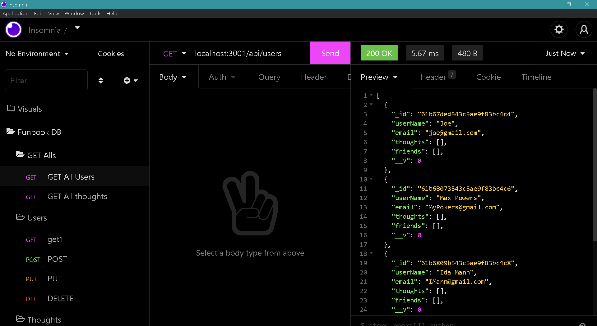

# FunBook


 <br />

## Table of Contents 

- [Description](#description)
- [Installation](#installation)
- [Screenshots](#screenshots)
- [Demos](#demos)
- [Deployed](#deployedapplicationlink)
- [Languages](#languages)
- [License](#license)
- [Questions](#questions)

<br />

## Description

API for a social network web application where users can share their thoughts, react to friends’ thoughts, and create a friend list. You’ll use Express.js for routing, a MongoDB database, and the Mongoose ODM.<br />

## Installation

Clone the repository from GitHub:
```
git clone git@github.com:Tonycodesnow/FunBook.git
```
Then, inside the folder, run the following command:
```
npm init
```
Then, install the dependencies with command:
```
npm i
```
Then, run the folloeing command to run the seed file:
```
npm run seed
```
When you're ready to run the application, from the root folder, type the below into your command line to start the server:
```
npm start
```
<br />

## Screenshots

screenshot in insomia

<p align="center"></p> <br />

## Demos

Click on the link below for a video demonstration of the application and the generated API routes:

https://watch.screencastify.com/v/Msr4QmhhK6oCwOCT5WZa


## Github application link

https://github.com/Tonycodesnow/FunBook  <br />

## Languages

JavaScript, Node, Inquirer, MongoDB database, Mongoose and Express.js API. <br />


## License

This project is licensed under the MIT license. <br />
  

## Questions?

If you have any questions, contact me at: 
tony.huertinez@gmail.com  <br />
Check out my other work at GitHUb:
[antoniohuerta](https://github.com/Tonycodesnow) <br />